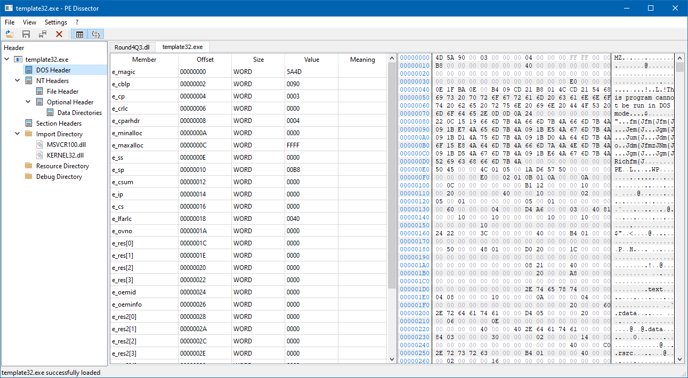
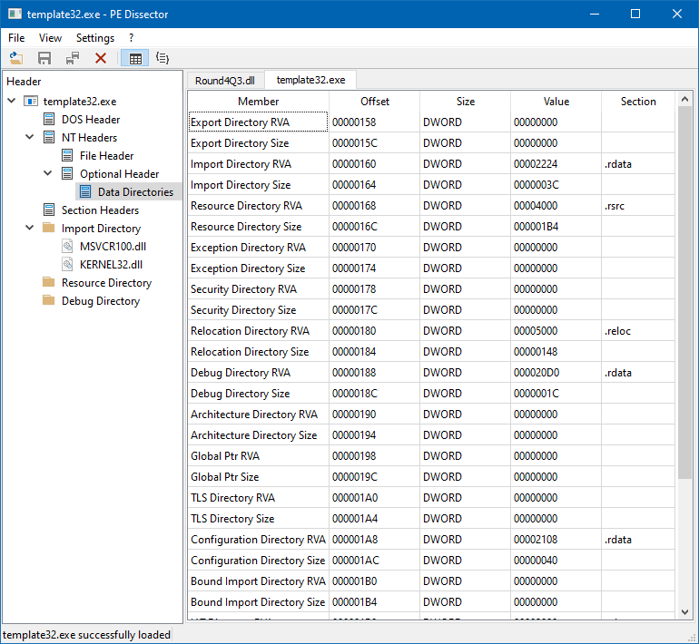
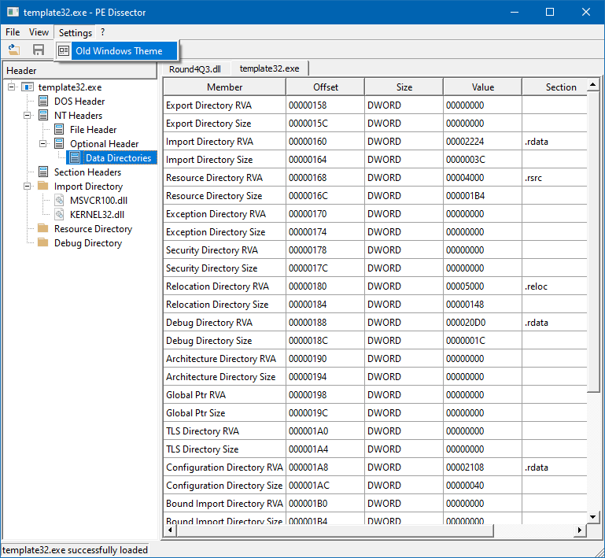

# PE-Dissector

## Introduction
PE Dissector is a Qt based open source application interfacing a C API that parse Portable Executables headers. 
I made this project to better understand the PE file format.

## Disclaimer
This is a work in progress project. 
Do not consider it to be fully functionnal. 
Unimplemented functions are grayed out. 
I found a lot of inspiration in <a href="https://ntcore.com/?tag=cff-explorer">CFF Explorer</a> and <a href="http://wjradburn.com/software/">PEView</a> so don't be surprised if you notice similarities.

## Features
What is working :
- support for 32 bit PE
- Opening multiple files in separate tabs
- Parsing and displaying PE Headers (DOS, NT, Sections)
- Parsing and displaying Export and Import directories
- Parsing Resource, Debug and TLS Directories
- Switching to old Windows theme

What isn't working (TODO) :
- support for 64 bit PE
- Slice the hex view to only display the header content
- Highlight the hex corresponding data when you click or move your mouse over a header member
- Not re-initializing the header selection in the tree view when switching tab
- Editing from the list view
- Editing from the hex view
- Writing edits to a file
- Displaying Resource, Debug and TLS Directories
- Parsing the rest of the directories
- Nice style of the list view
- Static linking in order to release a standalone executable.

## Screenshots

## Dependencies
- <a href="https://www.qt.io/">Qt 5.14.2</a>
- <a href="https://github.com/Dax89/QHexView">QHexView</a>

## License
PE Dissector is under the MIT License